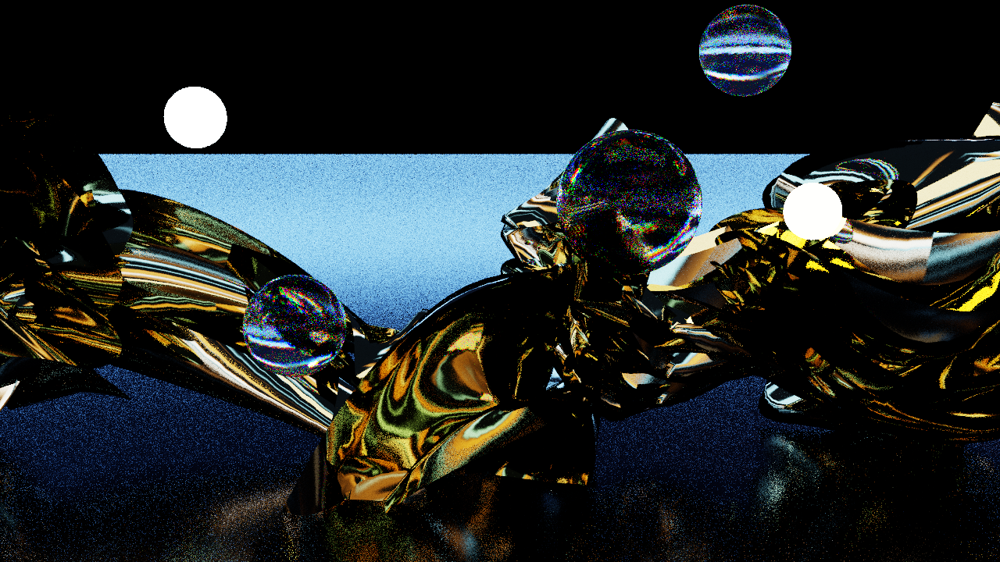
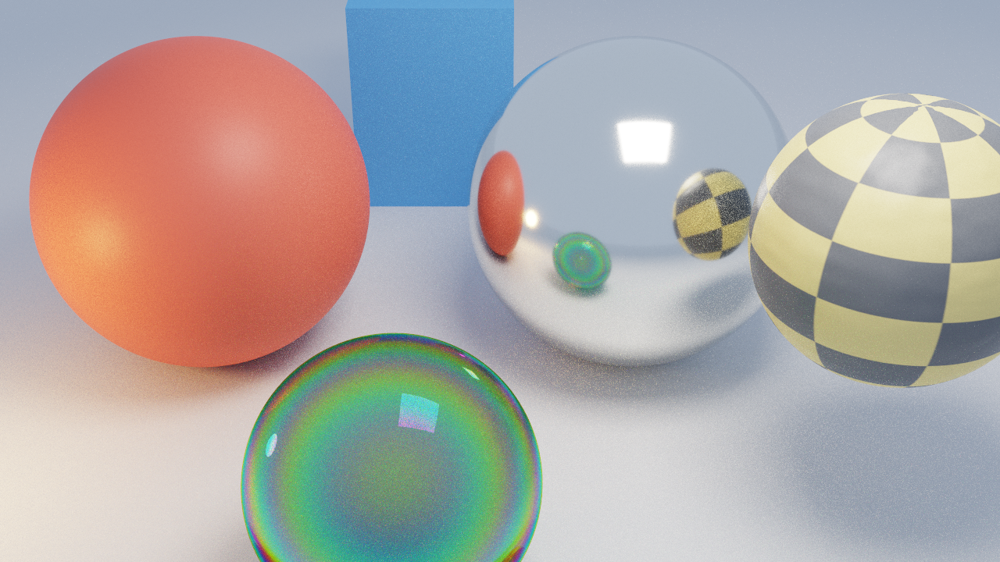
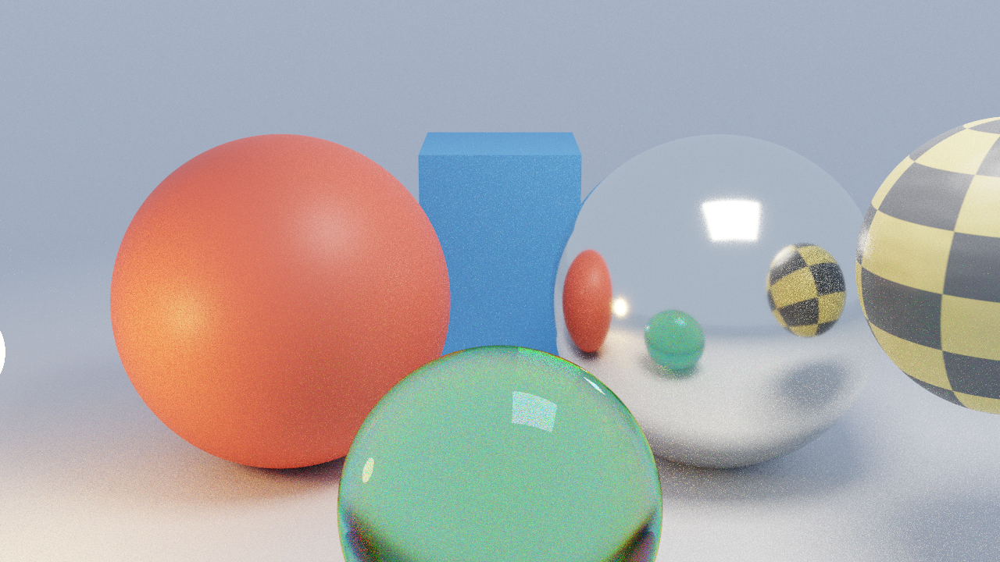

# RAYTRACER — Path tracer en tiempo real para TouchDesigner

Path tracer progresivo que corre dentro de TouchDesigner 2025 como un **GLSL POP** (un hilo por píxel) con
**ray tracing por hardware** (`rayQueryEXT` sobre un Collision POP) para mallas, objetos analíticos, materiales
PBR (GGX metal/roughness, vidrio con dispersión e iridiscencia, emisivos), luces de área con NEE + MIS, mapa de
entorno equirectangular, acumulación progresiva con reset automático y modo de render offline.



| | |
|---|---|
|  |  |

Verificado en TouchDesigner **2025.33230**, Windows 11, RTX 5070 Ti. Requiere una GPU con ray tracing por
hardware (RTX 20 o superior) y Windows; el ray tracing por hardware de TD no está disponible en macOS.

Para entender cómo está construido lee [ARCHITECTURE.md](ARCHITECTURE.md).

## Instalación

1. Clona el repositorio en cualquier carpeta.
2. Abre `RAYTRACER_reference.toe` (proyecto generado, listo) o crea el tuyo:
   abre un proyecto nuevo, **guárdalo en la raíz del repo** y ejecuta en el Textport (Alt+T):

```python
exec(open('td/build_network.py').read())
```

   El script es idempotente: crea `/project1/rt` o actualiza el existente sin perder tus conexiones.
   Si el .toe está en la raíz del repo, todas las rutas quedan relativas y el proyecto es portable. Si lo guardas
   en otro sitio, define la variable de entorno `RT_ROOT` con la ruta del repo antes de abrir TD.
3. La demo de ribbons de cromo (opcional):

```python
exec(open('td/demo_ribbons.py').read())
```

## Uso rápido

- El contenedor `rt` muestra `out_final` en su viewer. Orbita `rt/cam1` desde cualquier viewer 3D o anima sus
  parámetros; cualquier cambio de cámara, luz, material o geometría reinicia la acumulación, que converge en segundos.
- Los shaders viven en `shaders/` y los Text DATs los siguen en disco (**Sync to File**). Edita `trace.glsl` o
  `common.glsl` en tu editor y TD recompila al guardar. Errores de compilación: `rt/trace_pop` (errores) y
  `rt/trace_pop_info` (detalle).
- Todos los controles están en los parámetros personalizados de `rt`.

### Conectar tu geometría y texturas

`rt` tiene conectores reales. Si no conectas nada usa el contenido por defecto.

| Conector (In OP) | Qué espera |
|---|---|
| `in_mesh` (POP) | Cualquier POP de superficies (o `SOP to POP`). Necesita normales `N` de punto y `Tex` de **vértice** (Sphere/Grid/Box/Tube POP los crean; para otras mallas usa Normal POP y Texture Map POP o Attribute Convert POP). Puede animarse cada frame. |
| `in_albedo`, `in_rm`, `in_normal`, `in_emit` (TOP) | Mapas de material (rough/metal: r = roughness, g = metallic). Se activan con los toggles de la página Mesh. |
| `in_env` (TOP) | Mapa de entorno equirectangular (lat-long), como el Environment Light COMP de TD. Un `.hdr`/`.exr` por Movie File In conserva el rango float. Sin cubemaps ni muestreo por importancia. |

Materiales por primitiva dentro de una misma malla: atributos de punto `mat` (float) y `Color`, creados con un
Attribute POP y mezclados con Merge POP. `mat` 0 = material de la página Mesh, 1 = emisivo (Color × Mesh Emit
Intensity), 2 = vidrio (Color = tinte), 3 = cromo. `td/demo_ribbons.py` es el ejemplo completo.

### Parámetros de `rt`

| Página | Parámetros |
|---|---|
| Render | Bounces, Radiance Clamp (anti-fireflies), NEE, Exposure, ACES Tonemap, Show Sample Count, Resolution W/H, Denoise, Always Cook, Samples per Frame, Temporal Window, Reset When Textures Change, Reset When Geometry Changes |
| Offline | Offline Mode, Offline Samples per Frame, Record, Output File |
| Light | Rect light (posición, medio tamaño, color, intensidad), esfera emisiva (intensidad 0 = apagada), Sky Color/Intensity, Use Environment Map, Environment Visible to Camera, Environment Rotation |
| Scene | Floor (on/off, altura, color, metallic, roughness), Demo Objects |
| Materials | Metal sphere, Box, Glass (IOR, absorción), Mesh (color, metallic, roughness) |
| Mesh | Bound (centro/radio; radio 0 desactiva la malla), toggles de mapas, Normal Map Strength, Mesh Emit Intensity, UV Tiling |
| Glassfx | Dispersion, Iridescence, Iridescence Scale, Tinted Shadows Through Glass |

### Ruido: qué hacer según el caso

| Situación | Ajuste |
|---|---|
| Escena quieta | `Temporal Window` 0: acumulación infinita, converge del todo. |
| Texturas o luces animadas, geometría quieta | `Reset When Textures Change` off + `Temporal Window` 32–64: limpio, el cambio se funde en ~1 s. |
| Geometría o cámara en movimiento | `Reset When Geometry Changes` on + `Samples per Frame` 4–8: nítido; el cromo casi no tiene ruido, el vidrio con dispersión y los suelos rugosos sí. Con reset off y ventana baja queda suave pero con estelas. |
| Calidad final | Modo offline (abajo). |

`Denoise` usa el Nvidia Denoise TOP y **requiere instalar el NVIDIA Video Effects SDK (Maxine)**; sin él el
nodo devuelve una imagen vacía, por eso viene apagado.

### Render offline

Página Offline: `Offline Mode` apaga el realtime de TD, reinicia la acumulación cada frame y usa
`Offline Samples per Frame` (64 por defecto; 256 o más para calidad final). `Record` graba una secuencia PNG con
el Movie File Out `movieout` en `Output File` (por defecto `renders/raytracer` + sufijo de frame).
Flujo: fija el rango del timeline, Offline on, Record on, Play. Al apagar Offline vuelve el realtime.

### Rendimiento de referencia (720p, RTX 5070 Ti)

| Escena | Resultado |
|---|---|
| Ribbons demo, 35 000 triángulos animados, 8 spp | 60 fps (límite del realtime de TD) |
| Malla estática de 200 000 triángulos | sin caída apreciable |
| Malla de 5 000 triángulos por fuerza bruta (versión anterior sin RT por hardware) | 288 ms por frame |

## Estructura del repositorio

```
RAYTRACER_reference.toe   proyecto generado listo para abrir (rutas relativas, sin harness de pruebas)
RAYTRACER.toe             proyecto de trabajo del autor
shaders/                  common.glsl (BSDF, intersecciones, RNG), trace.glsl (kernel), display.frag,
                          env_default.frag, atlas_*.frag, checker.frag, legacy/ (kernel GLSL TOP de las Tareas 1-12)
td/build_network.py       construye/actualiza toda la red (idempotente)
td/accum_ctl.py           Execute DAT de inicio de frame: cámara, contador de samples, resets, entradas, offline
td/demo_ribbons.py        escena demo de ribbons de cromo
tools/                    harness para probar en TD sin intervención (ver ARCHITECTURE.md)
tests/probe/              shaders de sonda usados para verificar la API de TD
docs/images/              renders de referencia
PLAN_RAYTRACER_TD.md      plan original del proyecto
```

## Problemas conocidos

- El Nvidia Denoise TOP necesita el SDK de NVIDIA; sin él, mantén `Denoise` apagado.
- Sin muestreo por importancia del entorno: un HDRI con un sol pequeño hace ruido en superficies rugosas.
- Los objetos analíticos de demostración (esferas, caja) están fijos en el shader; se ocultan con `Demo Objects`.
- La geometría animada sin reset produce estelas; la reproyección temporal (Fase 5 del plan) está pendiente.
